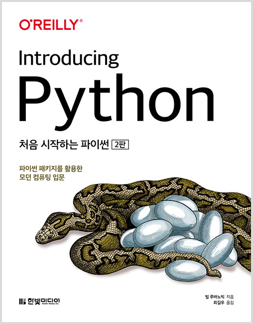

<!-- PROJECT LOGO -->
 

  
  <h3 style='border: none; margin-bottom: 5px;'>Introducing Python</h2>

# <처음 시작하는 파이썬> 정리

[처음 시작하는 파이썬](http://www.yes24.com/Product/Goods/91870652)의 코드와 연습문제를 정리한 Repository입니다.

책의 내용 및 코드의 저작권은 저자이신 **Bill Lubanovic** 님에게 있음을 알려드립니다.

## ✅ TODO

### CHAPTER 1. 파이(py) 맛보기

- [x] 1.1. 미스터리
- [x] 1.2. 작은 프로그램
- [x] 1.3. 조금 더 큰 프로그램
- [x] 1.4. 파이썬 활용
- [x] 1.5. 파이썬과 다른 언어
- [x] 1.6. 왜 파이썬인가?
- [x] 1.7. 상황에 따른 파이썬
- [x] 1.8. 파이썬 2와 파이썬 3
- [x] 1.9. 파이썬 설치하기
- [x] 1.10. 파이썬 실행하기
- [x] 1.11. 파이썬 철학
- [x] 1.12. 다음 장에서는
- [x] 1.13. 연습문제

### CHAPTER 2. 데이터: 타입, 값, 변수, 이름

- [x] 2.1. 파이썬 데이터는 객체다
- [x] 2.2. 타입
- [x] 2.3. 가변성
- [x] 2.4. 리터럴 값
- [x] 2.5. 변수
- [x] 2.6. 할당
- [x] 2.7. 변수는 장소가 아니라 이름이다
- [x] 2.8. 여러 이름 할당하기
- [x] 2.9. 이름 재할당
- [x] 2.10. 복사
- [x] 2.11. 좋은 변수 이름
- [x] 2.12. 다음 장에서는
- [x] 2.13. 연습문제

### CHAPTER 3. 숫자

- [x] 3.1. 불리언
- [x] 3.2. 정수
- [x] 3.3. 부동소수점 숫자
- [x] 3.4. 수학 함수
- [x] 3.5. 다음 장에서는
- [x] 3.6. 연습문제

### CHAPTER 4. 선택하기: if

- [x] 4.1. 주석 달기: #
- [x] 4.2. 라인 유지하기:
- [x] 4.3. 비교하기: if, elif, else
- [x] 4.4. True와 False
- [x] 4.5. 여러 개 비교하기: in
- [x] 4.6. 새로운 기능: 바다코끼리 연산자
- [x] 4.7. 다음 장에서는
- [x] 4.8. 연습문제

### CHAPTER 5. 텍스트 문자열

- [x] 5.1. 따옴표로 문자열 생성
- [x] 5.2. 문자열 타입으로 변환: str()
- [x] 5.3. 이스케이프 문자:
- [x] 5.4. 결합하기: +
- [x] 5.5. 복제하기: \*
- [x] 5.6. 문자 추출: [ ]
- [x] 5.7. 슬라이스로 부분 문자열 추출
- [x] 5.8. 문자열 길이: len()
- [x] 5.9. 문자열 나누기: split()
- [x] 5.10. 문자열 결합하기: join()
- [x] 5.11. 문자열 대체하기: replace()
- [x] 5.12. 문자열 스트립: strip()
- [x] 5.13. 검색과 선택
- [x] 5.14. 대소 문자
- [x] 5.15. 정렬
- [x] 5.16. 포매팅
- [x] 5.17. 더 많은 문자열 메서드
- [x] 5.18. 다음 장에서는
- [x] 5.19. 연습문제

### CHAPTER 6. 반복문: while과 for 문

- [x] 6.1. 반복하기: while
- [x] 6.2. 순회하기: for와 in
- [x] 6.3. 기타 이터레이터
- [x] 6.4. 다음 장에서는
- [x] 6.5. 연습문제

### CHAPTER 7. 튜플과 리스트

- [x] 7.1. 튜플
- [x] 7.2. 리스트
- [x] 7.3. 튜플 vs 리스트
- [x] 7.4. 튜플 컴프리헨션은 없다
- [x] 7.5. 다음 장에서는
- [x] 7.6. 연습문제

### CHAPTER 8. 딕셔너리와 셋

- [x] 8.1. 딕셔너리
- [x] 8.2. 셋
- [x] 8.3. 지금까지 배운 자료구조
- [x] 8.4. 자료구조 결합하기
- [x] 8.5. 다음 장에서는
- [x] 8.6. 연습문제

### CHAPTER 9. 함수

- [x] 9.1. 함수 정의하기: def
- [x] 9.2. 함수 호출하기: ()
- [x] 9.3. 인수와 매개변수
- [x] 9.4. 독스트링
- [x] 9.5. 일등 시민: 함수
- [x] 9.6. 내부 함수
- [x] 9.7. 익명 함수: lambda
- [x] 9.8. 제너레이터
- [x] 9.9. 데커레이터
- [x] 9.10. 네임스페이스와 스코프
- [x] 9.11. 이름에 \_와 \_\_ 사용하기
- [x] 9.12. 재귀 함수
- [x] 9.13. 비동기 함수
- [x] 9.14. 예외
- [x] 9.15. 다음 장에서는
- [x] 9.16. 연습문제

### CHAPTER 10. 객체와 클래스

- [x] 10.1. 객체란 무엇인가?
- [x] 10.2. 간단한 객체
- [x] 10.3. 상속
- [x] 10.4. 자신: self
- [x] 10.5. 속성 접근
- [x] 10.6. 메서드 타입
- [x] 10.7. 덕 타이핑
- [x] 10.8. 매직 메서드
- [x] 10.9. 애그리게이션과 콤퍼지션
- [x] 10.10. 객체는 언제 사용할까?
- [x] 10.11. 네임드 튜플
- [x] 10.12. 데이터 클래스
- [x] 10.13. attrs
- [x] 10.14. 다음 장에서는
- [x] 10.15. 연습문제

### CHAPTER 11. 모듈과 패키지

- [x] 11.1. 모듈과 import 문
- [x] 11.2. 패키지
- [x] 11.3. 파이썬 표준 라이브러리
- [x] 11.4. 배터리 장착: 다른 파이썬 코드 가져오기
- [x] 11.5. 다음 장에서는
- [x] 11.6. 연습문제

### CHAPTER 12. 데이터 길들이기

- [x] 12.1. 텍스트 문자열: 유니코드
- [x] 12.2. 정규 표현식
- [x] 12.3. 이진 데이터
- [x] 12.4. 보석 비유
- [x] 12.5. 다음 장에서는
- [x] 12.6. 연습문제

### CHAPTER 13. 날짜와 시간

- [x] 13.1. 윤년
- [x] 13.2. datetime 모듈
- [x] 13.3. time 모듈
- [x] 13.4. 날짜와 시간 읽고 쓰기
- [x] 13.5. 시간 모듈 변환
- [x] 13.6. 대체 모듈
- [x] 13.7. 다음 장에서는
- [x] 13.8. 연습문제

### CHAPTER 14. 파일과 디렉터리

- [x] 14.1. 파일 입출력
- [x] 14.2. 메모리 매핑
- [x] 14.3. 파일 명령어
- [x] 14.4. 디렉터리 명령어
- [x] 14.5. 경로 이름
- [x] 14.6. BytesIO와 StringIO
- [x] 14.7. 다음 장에서는
- [x] 14.8. 연습문제

### CHAPTER 15. 프로세스와 동시성

- [x] 15.1. 프로그램과 프로세스
- [x] 15.2. 명령 자동화
- [x] 15.3. 동시성
- [x] 15.4. 다음 장에서는
- [x] 15.5. 연습문제

### CHAPTER 16. 파일과 데이터베이스

- [x] 16.1. 플랫 텍스트 파일
- [x] 16.2. 패디드 텍스트 파일
- [x] 16.3. 표 형식 텍스트 파일
- [x] 16.4. 이진 파일
- [x] 16.5. 관계형 데이터베이스
- [x] 16.6. NoSQL 데이터 스토어
- [x] 16.7. 풀 텍스트 데이터베이스
- [x] 16.8. 다음 장에서는
- [] 16.9. 연습문제

### CHAPTER 17. 네트워크

- [ ] 17.1. TCP/IP
- [ ] 17.2. 네트워크 패턴
- [ ] 17.3. 요청-응답 패턴
- [ ] 17.4. 발행-구독 패턴
- [ ] 17.5. 인터넷 서비스
- [ ] 17.6. 웹 서비스와 API
- [ ] 17.7. 데이터 직렬화
- [ ] 17.8. 원격 프로시저 호출
- [ ] 17.9. 원격 관리 도구
- [ ] 17.10. 빅데이터
- [ ] 17.11. 클라우드
- [ ] 17.12. 도커
- [ ] 17.14. 다음 장에서는
- [ ] 17.15. 연습문제

### CHAPTER 18. 웹

- [ ] 18.1. 웹 클라이언트
- [ ] 18.2. 웹 서버
- [ ] 18.3. 웹 서버 프레임워크
- [ ] 18.4. 데이터베이스 프레임워크
- [ ] 18.5. 웹 서비스와 자동화
- [ ] 18.6. 웹 API와 REST
- [ ] 18.7. 크롤링과 스크래핑
- [ ] 18.8. 영화 검색 예제
- [ ] 18.9. 다음 장에서는
- [ ] 18.10. 연습문제

### CHAPTER 19. 파이써니스타 되기

- [ ] 19.1. 프로그래밍이란
- [ ] 19.2. 파이썬 코드 찾기
- [ ] 19.3. 패키지 설치
- [ ] 19.4. IDE
- [ ] 19.5. 이름과 문서
- [ ] 19.6. 타입 힌트
- [ ] 19.7. 테스트
- [ ] 19.8. 코드 디버깅
- [ ] 19.9. 로그 에러 메시지
- [ ] 19.10. 코드 최적화
- [ ] 19.11. 소스 컨트롤
- [ ] 19.12. 프로그램 배포
- [ ] 19.13. 이 책의 소스 코드
- [ ] 19.14. 더 배우기
- [ ] 19.15. 다음 장에서는
- [ ] 19.16. 연습문제

### CHAPTER 20. 파이 아트

- [ ] 20.1. 2D 그래픽
- [ ] 20.2. 3D 그래픽
- [ ] 20.3. 3D 애니메이션
- [ ] 20.4. GUI
- [ ] 20.5. 플롯, 그래프, 시각화
- [ ] 20.6. 게임
- [ ] 20.7. 소리와 음악
- [ ] 20.8. 다음 장에서는
- [ ] 20.9. 연습문제

### CHAPTER 21. 파이 비즈니스

- [ ] 21.1. MS 오피스
- [ ] 21.2. 비즈니스 업무
- [ ] 21.3. 비즈니스 데이터 처리
- [ ] 21.4. 오픈 소스 파이썬 비즈니스 패키지
- [ ] 21.5. 금융과 파이썬
- [ ] 21.6. 데이터 보안
- [ ] 21.7. 지도
- [ ] 21.8. 다음 장에서는
- [ ] 21.9. 연습문제

### CHAPTER 22. 파이 과학

- [ ] 22.1. 수학 및 통계 표준 라이브러리
- [ ] 22.2. 과학과 파이썬
- [ ] 22.3. 넘파이
- [ ] 22.4. 사이파이
- [ ] 22.5. 사이킷
- [ ] 22.6. 판다스
- [ ] 22.7. 파이썬과 과학 분야
- [ ] 22.8. 다음 장에서는
- [ ] 22.9. 연습문제

### Appendix

- [ ] Appendix A. 하드웨어와 소프트웨어
- [ ] Appendix B. 파이썬 3 설치
- [ ] Appendix C. 완전히 다른 것: Async
- [ ] Appendix D. 연습문제 정답
- [ ] Appendix E. 커닝페이퍼
